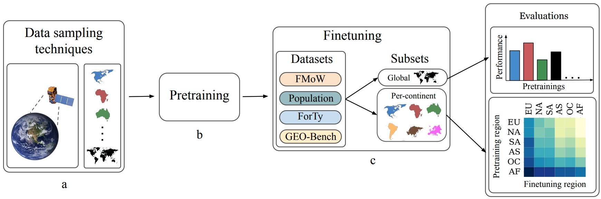
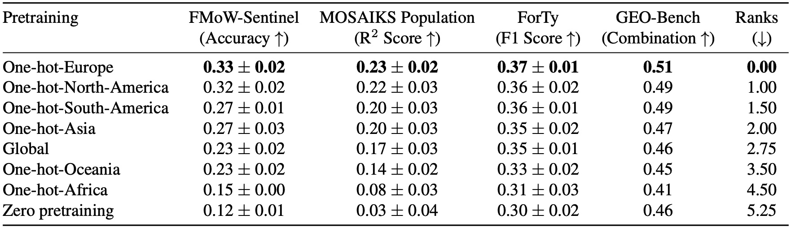
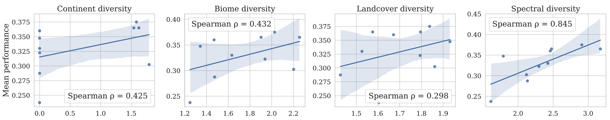

<div align="center">
  
[](https://arxiv.org/pdf/2604.21104)
[](https://github.com/sustainlab-group/SatMAE)
[](https://huggingface.co/Amandeep10/pretrain-where-SatMAE-weights)
[](https://huggingface.co/datasets/Amandeep10/pretrain-where-pretraining-datasets)

</div>

### Paper Summary with Author's Commentary 💬
There are 180+ Geospatial Foundational Models to date. Most of these models introduce a new architecture and a new pretraining dataset (with different data sampling strategies). The model architecture progress becomes non-additive as the contribution of their pretraining dataset is not known (pretraining dataset is not ablated). We wanted to study the impact of the geographical context of pretraining data on the model's downstream performance. In a preliminary experiment, we found that the impact of changing the geographic context (defined by continents for the scope of this project) of the pretraining dataset was huge! Comparable to the most tuned hyperparameter, the learning rate! So we were motivated, and the rest followed. Next, we define our experimental setup:

a) **Pretraining datasets:** Europe-only, North-America-only, South-America-only, Africa-only, Asia-only, Oceania-only, and Global.

b) **Model:** SatMAE

c) **Downstream tasks:** FMoW-Sentinel, MOSAIKS population density estimation, Forest Typology (ForTy), and GEO-Bench. We create global and per-continent subsets of these tasks for detailed evaluation.

d) **Evaluation:** Conducted using KNN, linear probing, and full finetuning. Linear probing results are discussed in the paper, while KNN and full finetuning follow similar trends.


We found that Europe-only or **One-hot-Europe pretraining  outperformed global and all other pretraining schemes on all downstream tasks**. We also see a consistent ranking in performances: Europe > North America > South America > Asia > Global > Oceania > Africa > Zero pretraining. We assumed Global pretraining would be the top-performer, Europe beating Global is SURPRISING! 😮



Digging deeper, on per-continent downstream subsets, Europe outperformed all pretraining schemes on their corresponding tasks as well. For example, Europe performs better than Africa on the Africa subset of downstream tasks. SURPRISING!! 😲

The trends remain consistent across tasks and downstream evaluation schemes, i.e., KNN and full finetuning.

### Impact of extensive finetuning 💪
We were almost sure that finetuning with a dataset the size of the pretraining dataset would level these results out, but NO, when we finetune the 7-pretrained variants on FMoW-Sentinel full (700k samples, same as the size of pretraining datasets used), **the models still show a gap in performance**. SURPRISING!!! 😳

### What makes the Europe dataset special? 🤔🔎
Super curious, we wanted to know what made the Europe dataset so special? As geospatial researchers, we thought of looking at diversity through biomes and landcover classes (also used by several works to create new diverse pretraining datasets). None of them seemed to correlate strongly, so **we looked at spectral entropy, and we found a strong correlation**.



Spectral entropy is very different from the other measures. Continent, biome, and landcover diversities/entropies are dataset-level features dependent on the proportion of data coming from each subgroup. Most dataset creators, when trying to create diverse datasets, ensure sampling for all continents/biomes/landcover classes. But what we found seems to point towards the superiority of a sample-level diversity. This is not new; some works are already doing smart sample selections like Galileo (https://arxiv.org/pdf/2502.09356). 

### Closing notes 🙏
A lot of things are missing in the project; a similar detailed study could be done for biomes, landcover classes, ecoregions, etc. But the scope was limited due to resource and time constraints.

Hope you enjoyed reading this summary as much as I enjoyed working on this project. For any questions, please reach out to me at akaur64@asu.edu. To cite this work, please use:
```
@misc{kaur2026pretrainwhereinvestigatingpretraining,
      title={Pretrain Where? Investigating How Pretraining Data Diversity Impacts Geospatial Foundation Model Performance}, 
      author={Amandeep Kaur and Mirali Purohit and Gedeon Muhawenayo and Esther Rolf and Hannah Kerner},
      year={2026},
      eprint={2604.21104},
      archivePrefix={arXiv},
      primaryClass={cs.CV},
      url={https://arxiv.org/abs/2604.21104}, 
}
```
